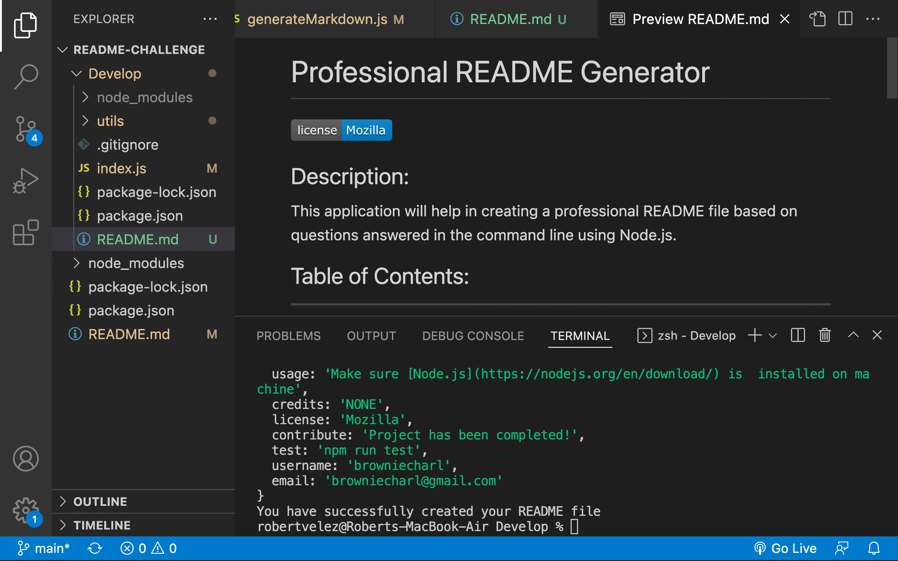

# Professional README Generator

## Description
This application will help in creating a professional README file based on questions answered in the command line using Node.js.

## Installation
- Make sure [Node.js](https://nodejs.org/en/download/) is  installed on machine
- Clone repository from GitHub
- In terminal run "npm init" to install a package and any packages it depends on [npm init Documentation](https://docs.npmjs.com/cli/v8/commands/npm-init)
- In terminal run "npm install inquirer" [Inquirer Documentation](https://www.npmjs.com/package/inquirer?activeTab=readme#installation)
- You should now be able to run "node index.js" and answer the necessary questions

## Usage
### Screenshot

Made by Robert Velez

